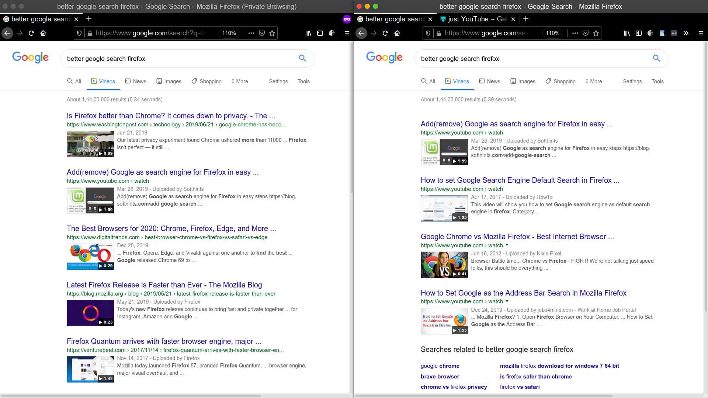

<h1 align="center">💻 just-YouTube</h1>

Extension to show only YouTube results in Google Videos Search based on <b>Levelsio's <a href="https://twitter.com/levelsio/status/1226061048060334080" target="_blank">Tweet</a></b>

  
  
  

<h3 align="center">🙋‍♂️ Made by <a href="https://twitter.com/_abhijithv">@abhijithvijayan</a></h3>

  Donate:
  <a href="https://www.paypal.me/iamabhijithvijayan" target='_blank'><i><b>PayPal</b></i></a>,
  <a href="https://www.patreon.com/abhijithvijayan" target='_blank'><i><b>Patreon</b></i></a>

  

❤️ it? ⭐️ it on [GitHub](https://github.com/abhijithvijayan/just-YouTube/stargazers) or [Tweet](https://twitter.com/intent/tweet?text=Check%20out%20just-YouTube%21%20by%20%40_abhijithv%0A%0Ahttps%3A%2F%2Fgithub.com%2Fabhijithvijayan%2Fjust-YouTube%0A%0A%23chrome%20%23google%20%23search%20%23youtube%20%23firefox%20%23javascript) about it.

## Browser Support

|  |  |  |  |  |  |  |
---------------------------------------------------------------------------------------------------------------------------------------------------------------------------| --------------------------------------------------------------------------------------------------------------------------------------------- |-------------------------------------------------------------------------------------------------------------------|---------------------------------------------------------------------------------------------------------------------------------------------------------------------| ------------------------------------------------------------------------------------------------------------------------------------------------------------------------ | ------------------------------------------------------------------------------------------------------------------------------------------------------------------------------ |------------------------------------------------------------------------------------------------------------------------------------------------------------------------------ |
| 88 & later ✔                                                                                                                                                              | 52 & later ✔ | 74 & later ✔                                                                                                      | 88 & later ✔                                                                                                                                                        | Latest ✔ | Latest ✔ | Latest ✔

## Table of Contents

- [Installation](#installation)
- [🚀 Quick Start](#🚀-quick-start)
- [Issues](#issues)
  - [🐛 Bugs](#-bugs)
- [LICENSE](#license)

## Installation

### Download for browser(s)

- Chrome: [just-YouTube :: Chrome Web Store](https://chrome.google.com/webstore/detail/olkdooiamjknhokmihlikgjigcilbahh)
- Firefox: [just-YouTube :: Add-ons for Firefox](https://addons.mozilla.org/firefox/addon/just-youtube/)
- Opera [just-YouTube :: Opera addons](#for-opera)
- Edge: [just-YouTube :: Chrome Web Store](https://chrome.google.com/webstore/detail/olkdooiamjknhokmihlikgjigcilbahh)

#### For Opera

In order to install this extension from Chrome Web Store, another opera extension called **Install Chrome Extension** should be installed first.

- [Opera addon :: Install Chrome Extension](https://addons.opera.com/en/extensions/details/install-chrome-extensions/)

## 🚀 Quick Start

- `yarn install` to install dependencies.
- `yarn run dev:chrome` to start the development server for chrome extension.
- `yarn run dev:firefox` to start the development server for firefox addon.
- `yarn run dev:opera` to start the development server for opera extension.
- `yarn run build:chrome` to build chrome extension.
- `yarn run build:firefox` to build firefox addon.
- `yarn run build:opera` to build opera extension.
- `yarn run build` builds and packs extensions all at once to extension/ directory.

## Issues

_Looking to contribute? Look for the [Good First Issue](https://github.com/abhijithvijayan/just-YouTube/issues?q=is%3Aissue+is%3Aopen+sort%3Aupdated-desc+label%3A%22good+first+issue%22)
label._

### 🐛 Bugs

Please file an issue [here](https://github.com/abhijithvijayan/just-YouTube/issues/new) for bugs, missing documentation, or unexpected behavior.

[**See Bugs**](https://github.com/abhijithvijayan/just-YouTube/issues?q=is%3Aissue+is%3Aopen+sort%3Aupdated-desc+label%3A%22type%3A+bug%22)

### Linting Config

- Shared Eslint & Prettier Configuration - [`@abhijithvijayan/eslint-config`](https://www.npmjs.com/package/@abhijithvijayan/eslint-config)

## License

MIT © [Abhijith Vijayan](https://abhijithvijayan.in)